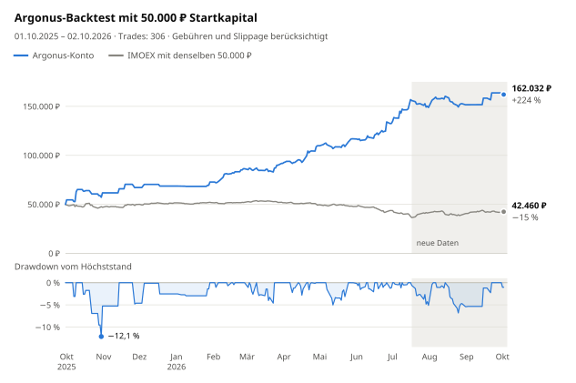

# argonus-moex

[](README.md) [](README.en.md) [](README.zh-CN.md) [](README.es.md) [](README.pt-BR.md) [](README.ja.md) [](README.ko.md)

[](https://hits.sh/github.com/Solrikk/argonus-moex/)

Argonus ist ein Python-Projekt für den Intraday-Handel mit Aktien der Moskauer
Börse (MOEX) über die T-Invest-API. Jeden Morgen wählt der Bot einen Trade aus der
Watchlist, steigt um 07:05 Uhr Moskauer Zeit anhand des Orderbuchs ein und setzt
sofort Stop und Take-Profit. Bis 09:30 Uhr ergänzt er Trades aus einem Scanner,
der alle liquiden Aktien prüft. Positionen werden am selben Tag geschlossen. Das
Repository enthält außerdem die Backtests und Studien, mit denen die Regeln
ausgewählt wurden.

## Backtest-Ergebnisse

<picture>
  <source media="(prefers-color-scheme: dark)" srcset="docs/assets/backtest/equity-de-dark.svg">
  
</picture>

Der Backtest führt ein Konto mit 50.000 ₽ ohne Einzahlungen oder Neustarts durch
alle Handelstage vom 1. Oktober 2025 bis zum 2. Oktober 2026. Er bildet die
aktuelle Konfiguration in [`scripts/run_tick.sh`](scripts/run_tick.sh) ab: den
Einstieg um 07:05 Uhr und den Morgen-Scanner. Gebühren von 0,04 % und Slippage von
0,05 % je Seite eines Trades sind bereits abgezogen.

| Kennzahl | Wert |
| --- | ---: |
| Endkontostand | **162.032 ₽ (+224,1 %)** |
| Trades | 306, davon 49,7 % profitabel |
| Maximaler Drawdown | −12,1 % zum Tagesschluss, −17,8 % zu den ungünstigsten Intraday-Kursen |
| Nur Einstieg um 07:05, ohne Scanner | 136.495 ₽ (+173,0 %) |
| IMOEX im selben Zeitraum | −15,1 % |

<details>
<summary>Ergebnisse nach Monaten</summary>

| Monat | Ergebnis | Rendite | Trades | davon Scanner | Gewinner |
| --- | ---: | ---: | ---: | ---: | ---: |
| Oktober 2025 | +11.731 ₽ | +23,5 % | 11 | 0 | 5 |
| November 2025 | +5.450 ₽ | +8,8 % | 5 | 0 | 3 |
| Dezember 2025 | +1.475 ₽ | +2,2 % | 3 | 0 | 2 |
| Januar 2026 | +4.101 ₽ | +6,0 % | 4 | 0 | 2 |
| Februar 2026 | +13.596 ₽ | +18,7 % | 28 | 24 | 18 |
| März 2026 | +5.453 ₽ | +6,3 % | 46 | 42 | 20 |
| April 2026 | +17.988 ₽ | +19,6 % | 37 | 28 | 21 |
| Mai 2026 | +7.051 ₽ | +6,4 % | 32 | 24 | 18 |
| Juni 2026 | +15.728 ₽ | +13,5 % | 52 | 44 | 24 |
| Juli 2026 | +16.280 ₽ | +12,3 % | 49 | 36 | 20 |
| August 2026 | +2.763 ₽ | +1,9 % | 34 | 24 | 16 |
| September 2026 | +12.111 ₽ | +8,0 % | 4 | 1 | 3 |
| 1.–2. Oktober 2026 | −1.696 ₽ | −1,0 % | 1 | 0 | 0 |

Die Monatsrendite bezieht sich auf den Kontostand zu Beginn des Monats.

</details>

### So sind die Ergebnisse zu lesen

- **95 % des Gewinns entstanden auf den Daten, mit denen die Regeln ausgewählt
  wurden.** Die Regeln für den Einstieg um 07:05 Uhr wurden auf Daten bis zum
  16. Juli 2026 ausgewählt; bis zu diesem Tag wuchs das Konto um 213,8 %. Der graue
  Bereich im Diagramm zeigt die Tage danach: Das Konto legte 3,3 % zu, der IMOEX
  12,7 %.
- **Der Scanner handelt nur in einem Teil des Zeitraums.** Von Oktober bis Januar
  werden seine Modelle erst trainiert, Februar und März dienten der Auswahl der
  Architektur, und die Morgendaten enden am 9. September 2026. Die Architektur
  wurde im Oktober 2026 auf demselben Archiv ausgewählt, daher ist auch der graue
  Bereich für die Scanner-Trades kein unabhängiger Test.
- **Die Ausführung ist vereinfacht.** Die Simulation rechnet mit Bruchteilen von
  Lots und hat weder ein historisches Orderbuch noch eine Prüfung, ob Leerverkäufe
  möglich sind. Bei 0,2 % Slippage je Seite verringert der Scanner den Gewinn,
  statt ihn zu erhöhen.
- **Positionen mit bis zu 3-fachem Hebel.** Offene Positionen betragen insgesamt
  höchstens 150.000 ₽ und höchstens das Dreifache des Kontokapitals, daher ist die
  Kontorendite nicht direkt mit dem Index vergleichbar. Der IMOEX ist ein
  Kursindex ohne Dividenden.

> [!WARNING]
> Backtest-Ergebnisse garantieren keine künftigen Renditen und sind keine
> Anlageempfehlung.

## So funktioniert die Strategie

1. **Watchlist.** [`generate_watchlist`](argonus/watchlists/generate_watchlist.py)
   prüft TQBR-Aktien anhand von Tageskerzen und wählt je drei Long- und
   Short-Kandidaten mit den Zielen T1–T4.
2. **Auswahl um 07:00 Uhr Moskauer Zeit.** Der Analyzer ordnet die Kandidaten.
   Der Haupteinstieg entfällt, wenn seine Richtung nicht zum Marktregime passt
   (Long nur, wenn der IMOEX über seinem EMA20 liegt, Short nur darunter), wenn ein
   Short-Kandidat in 10 Tagen um mehr als 8 % gestiegen ist oder wenn das Ziel T4
   näher als 2 % liegt, also weniger als zwei Stops entfernt. Der RS5-Selektor
   nimmt den ersten der drei besten Kandidaten, dessen relative Stärke zum Index
   über fünf Tage nicht schlechter als −2,39 Prozentpunkte ist.
3. **Einstieg um 07:05 Uhr.** Nach der ersten vollständigen Fünf-Minuten-Kerze
   sendet der Bot eine einzige FOK-Order. Ein Orderbuch mit Tiefe 50 muss die
   gesamte Größe abdecken und darf höchstens 3 Sekunden alt sein; der
   durchschnittliche Ausführungskurs darf höchstens 0,1 % vom besten Kurs abweichen.
4. **Ausstieg.** Der Stop liegt 1 % vom Einstiegskurs entfernt. Das Take-Profit
   liegt, gemessen vom tatsächlichen Ausführungskurs, 25 % weiter entfernt als das
   Ziel T4. Um 18:35 Uhr wird die Position in jedem Fall geschlossen.
5. **Morgen-Scanner.** Von 07:20 bis 09:30 Uhr prüft er alle 5 Minuten alle
   liquiden Aktien auf eine fortgesetzte Morgenbewegung, eine erschöpfte Bewegung
   und eine sich schließende Kurslücke. Zwei Modelle, Ridge-Regression und flaches
   Gradient Boosting, sagen die Rendite eines Trades nach Kosten voraus. Der
   Einstieg erfolgt, wenn die durchschnittliche Prognose mindestens +0,15 %
   beträgt, mit 1 % Stop und 2 % Ziel. Die Modelle werden jeden Monat nur mit
   vergangenen Daten neu trainiert.
6. **Gemeinsame Limits.** Höchstens drei Positionen gleichzeitig, insgesamt bis zu
   150.000 ₽ und höchstens das Dreifache des Kapitals. Das Risiko aller Stops ist
   auf 3 % des Kapitals begrenzt; nach einem Tagesverlust von 3 % werden keine
   neuen Einstiege eröffnet.

Nach der Ausführung speichert der Bot den tatsächlichen Kurs und setzt zuerst
STOP_LOSS, dann TAKE_PROFIT. Verlorene Antworten des Brokers werden anhand der
Order-ID abgeglichen, FOK-Orders werden nie erneut gesendet.

## Projektstruktur

```text
argonus/
  trading/       Trading-Bot und Orderausführung
  strategies/    Signale und Risikoregeln
  watchlists/    Erstellung von Watchlists und Auswahl von Kandidaten
  market_data/   Marktdaten von MOEX und T-Invest
  models/        Code für Prognosemodelle
  shadow/        Datenerfassung und Auswertung von Shadow-Experimenten
  backtesting/   Historische Simulationen
  research/      Strategieforschung
  training/      Modelltraining
  runtime/       Tick-Scheduler
config/          Konfiguration von Shadow-Experimenten und Aktivierungsvorlagen
scripts/         Startskripte, lokale Überprüfung und README-Diagramme
tests/           Tests
docs/assets/     Sprachschaltflächen und Backtest-Diagramme
data/            Lokale Marktdaten und Berichte
models/          Lokal gespeicherte trainierte Modelle
runtime/         Lokale Protokolle und Bot-Zustand
```

## Installation

Python 3.10 oder neuer wird benötigt. Führe die Befehle im Stammverzeichnis des
Projekts aus.

```bash
python3 -m venv .venv
source .venv/bin/activate
python -m pip install -e '.[research]'
```

## Überprüfung

```bash
python -m unittest discover -s tests -t .
./run_candidate.sh --dry-run --once
python -m argonus.trading.trade_bot --help
python -m argonus.watchlists.generate_watchlist --help
```

Die Tests verwenden simulierte Antworten des Brokers und temporäre Dateien.
Prüfungen, die historische Archive, gespeicherte Modelle oder lokale
Aktivierungsmanifeste voraussetzen, werden übersprungen, wenn die erforderlichen
Dateien fehlen. Diese Dateien sind nicht im öffentlichen Repository enthalten.

## Datenzugriff

```bash
cp .tbank_token.example .tbank_token
chmod 600 .tbank_token
```

Die Datei `.tbank_token` enthält den Platzhalter `YOUR_TBANK_API_TOKEN_HERE`.
Ersetze ihn durch deinen eigenen Token, um T-Invest zu nutzen. Die
Umgebungsvariable `TINVEST_TOKEN` wird ebenfalls unterstützt. Speichere deinen
tatsächlichen Token ausschließlich lokal: `.tbank_token` und `.env` sind von
Git ausgeschlossen. Der Name des Brokerkontos wird über `BOT_ACCOUNT_NAME`
festgelegt; der Platzhalterwert lautet `YOUR_ACCOUNT_NAME`.

Um eine Watchlist mit heruntergeladenen Marktdaten zu erstellen:

```bash
python -m argonus.watchlists.generate_watchlist -o data/watchlists/watchlist.txt
```

## Bot ausführen

```bash
./run_tick.sh                        # ein Tick ohne Orders
./run_tick.sh --live                 # ein Tick mit echten Orders
./run_candidate.sh --dry-run --once  # Zeitplan prüfen, ohne den Broker zu kontaktieren
```

Die Schleife `./run_candidate.sh` führt werktags von 06:50 bis 23:45 Uhr Moskauer
Zeit alle 30 Sekunden einen Tick aus. Sie ruft `run_tick.sh` ohne `--live` auf und
sendet daher keine Orders. Eine Datei `PAUSE` im Stammverzeichnis des Projekts
stoppt die Ticks. Datenabfragen können einen Token und ein Konto voraussetzen.

Die öffentliche Version enthält in `config/*activation_manifest.example.json`
nur nicht aktivierte Vorlagen für Aktivierungsmanifeste für den Produktionsbetrieb.
Sie zeigen die Konfigurationsstruktur und erfordern eigene Artefakte, Prüfsummen
und Einstellungen. Manifeste für Shadow-Experimente arbeiten ausschließlich im
Modus `shadow_only`.

## Backtest reproduzieren

Der Backtest benötigt lokale Kerzenarchive und vorbereitete Datensätze in `data/`,
die nicht im öffentlichen Repository enthalten sind. Wenn sie vorhanden sind:

```bash
python -m argonus.backtesting.backtest_opening_all_months
python -m scripts.render_backtest_chart
```

Der erste Befehl schreibt `data/backtests/opening_integration_2026-10-03/all_months.json`
und `all_months.csv`. Der zweite zeichnet die Diagramme in `docs/assets/backtest/`
für alle README-Sprachen neu. Das Skript `scripts/validate_opening_integration.py`
prüft Produktionsmanifeste und Modelle in derselben lokalen Installation.

## Entwicklung

Füge neue Forschungsarbeiten unter `argonus/research/` und Tests unter `tests/`
hinzu. Verwende `argonus.paths` für die Datenpfade. Führe den Code als
Python-Modul aus: `python -m argonus.<package>.<module>`.
