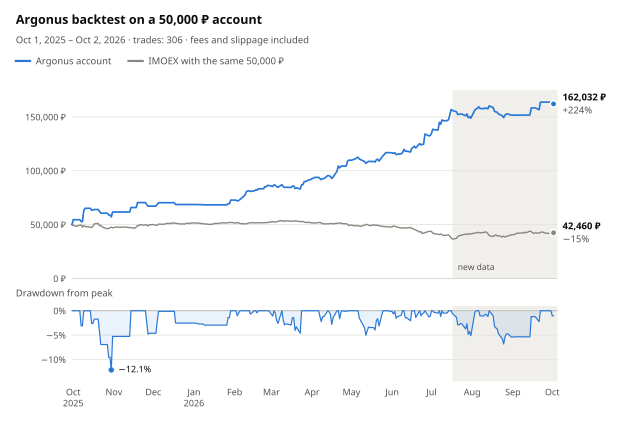

# argonus-moex

[](README.md) [](README.zh-CN.md) [](README.es.md) [](README.pt-BR.md) [](README.ja.md) [](README.ko.md) [](README.de.md)

[](https://hits.sh/github.com/Solrikk/argonus-moex/)

Argonus is a Python project for intraday trading of Moscow Exchange (MOEX) stocks
through the T-Invest API. Every morning the bot picks a trade from its watchlist,
enters at 07:05 Moscow time based on the live order book, and immediately places
a stop and a take-profit. Until 09:30 it adds trades from a scanner that covers
all liquid shares. Positions are closed the same day. The repository also contains
the backtests and research used to choose the rules.

## Backtest results

<picture>
  <source media="(prefers-color-scheme: dark)" srcset="docs/assets/backtest/equity-en-dark.svg">
  
</picture>

The backtest carries one 50,000 ₽ account through every trading day from
October 1, 2025 to October 2, 2026, with no deposits or resets. It follows the
current configuration in [`scripts/run_tick.sh`](scripts/run_tick.sh): the 07:05
entry plus the morning scanner. A 0.04% fee and 0.05% slippage on each side of
every trade are already deducted.

| Metric | Value |
| --- | ---: |
| Final balance | **162,032 ₽ (+224.1%)** |
| Trades | 306, 49.7% profitable |
| Maximum drawdown | −12.1% at the daily close, −17.8% at the worst intraday prices |
| 07:05 entry only, without the scanner | 136,495 ₽ (+173.0%) |
| IMOEX over the same period | −15.1% |

<details>
<summary>Monthly results</summary>

| Month | P&L | Return | Trades | Scanner trades | Winners |
| --- | ---: | ---: | ---: | ---: | ---: |
| October 2025 | +11,731 ₽ | +23.5% | 11 | 0 | 5 |
| November 2025 | +5,450 ₽ | +8.8% | 5 | 0 | 3 |
| December 2025 | +1,475 ₽ | +2.2% | 3 | 0 | 2 |
| January 2026 | +4,101 ₽ | +6.0% | 4 | 0 | 2 |
| February 2026 | +13,596 ₽ | +18.7% | 28 | 24 | 18 |
| March 2026 | +5,453 ₽ | +6.3% | 46 | 42 | 20 |
| April 2026 | +17,988 ₽ | +19.6% | 37 | 28 | 21 |
| May 2026 | +7,051 ₽ | +6.4% | 32 | 24 | 18 |
| June 2026 | +15,728 ₽ | +13.5% | 52 | 44 | 24 |
| July 2026 | +16,280 ₽ | +12.3% | 49 | 36 | 20 |
| August 2026 | +2,763 ₽ | +1.9% | 34 | 24 | 16 |
| September 2026 | +12,111 ₽ | +8.0% | 4 | 1 | 3 |
| October 1–2, 2026 | −1,696 ₽ | −1.0% | 1 | 0 | 0 |

Each month's return is measured against the balance at the start of that month.

</details>

### How to read these results

- **95% of the profit was earned on the data used to choose the rules.** The
  07:05 entry rules were selected on data through July 16, 2026; by that date the
  account was up 213.8%. The shaded area on the chart covers the days after that:
  the account gained 3.3% while IMOEX gained 12.7%.
- **The scanner trades for only part of the period.** From October to January
  its models are still training, February and March were used to choose its
  architecture, and the morning data end on September 9, 2026. The architecture
  was chosen in October 2026 on the same archive, so even the shaded area is not
  an independent test of the scanner's trades.
- **Execution is simplified.** The simulation uses fractional lots and has no
  historical order book or short-availability check. At 0.2% slippage per side,
  the scanner reduces profit instead of adding to it.
- **Positions use up to 3× leverage.** Open positions total at most 150,000 ₽ and
  no more than three times the account equity, so the account return is not
  directly comparable with the index. IMOEX is a price index without dividends.

> [!WARNING]
> Backtest results do not guarantee future returns and are not investment advice.

## How the strategy works

1. **Watchlist.** [`generate_watchlist`](argonus/watchlists/generate_watchlist.py)
   scans TQBR shares on daily candles and selects three long and three short
   candidates with targets T1–T4.
2. **Trade selection at 07:00 Moscow time.** The analyzer ranks the candidates.
   The main entry is skipped when its direction disagrees with the market regime
   (long only when IMOEX is above its EMA20, short only when it is below), when a
   short candidate has risen more than 8% in 10 days, or when the T4 target is
   closer than 2%, that is, less than two stops away. The RS5 selector takes the
   first of the top three candidates whose five-day strength relative to the index
   is no worse than −2.39 percentage points.
3. **Entry at 07:05.** After the first complete five-minute candle, the bot sends
   a single FOK order. A depth-50 order book must cover the whole size and be no
   older than 3 seconds, and the average fill price must be within 0.1% of the
   best price.
4. **Exit.** The stop is 1% from the entry price. The take-profit is 25% farther
   away than the T4 target, measured from the actual fill price. At 18:35 the
   position is closed regardless.
5. **Morning scanner.** From 07:20 to 09:30, every 5 minutes, it checks all liquid
   shares for a continuing morning move, an exhausted move, and a gap that is
   closing. Two models, ridge regression and shallow gradient boosting, predict
   each trade's return after costs. It enters when the average forecast is at
   least +0.15%, with a 1% stop and a 2% target. The models are retrained every
   month on past data only.
6. **Shared limits.** At most three positions at once, 150,000 ₽ in total and no
   more than 3× equity. The combined stop risk is capped at 3% of equity, and new
   entries stop after a 3% daily loss.

After a fill, the bot records the actual price, then places STOP_LOSS followed by
TAKE_PROFIT. Lost broker responses are reconciled by order ID, and FOK orders are
never resubmitted.

## Project structure

```text
argonus/
  trading/       Trading bot and order execution
  strategies/    Signals and risk rules
  watchlists/    Watchlist generation and candidate selection
  market_data/   MOEX and T-Invest market data
  models/        Predictive model code
  shadow/        Shadow experiment data collection and evaluation
  backtesting/   Historical simulations
  research/      Strategy research
  training/      Model training
  runtime/       Tick scheduler
config/          Shadow experiment settings and activation templates
scripts/         Launch scripts, local validation and README charts
tests/           Tests
docs/assets/     Language buttons and backtest charts
data/            Local market data and reports
models/          Local trained models
runtime/         Local logs and bot state
```

## Installation

Requires Python 3.10 or later. Run the commands from the project root.

```bash
python3 -m venv .venv
source .venv/bin/activate
python -m pip install -e '.[research]'
```

## Validation

```bash
python -m unittest discover -s tests -t .
./run_candidate.sh --dry-run --once
python -m argonus.trading.trade_bot --help
python -m argonus.watchlists.generate_watchlist --help
```

Tests use mock broker responses and temporary files. Checks that depend on
historical archives, saved models, or local activation manifests are skipped
when the required files are absent. These files are not included in the public
repository.

## Data access

```bash
cp .tbank_token.example .tbank_token
chmod 600 .tbank_token
```

The `.tbank_token` file contains the placeholder `YOUR_TBANK_API_TOKEN_HERE`.
Replace it with your own token to use T-Invest. The `TINVEST_TOKEN` environment
variable is also supported. Keep your actual token local: `.tbank_token` and
`.env` are excluded from Git. Set the broker account name through
`BOT_ACCOUNT_NAME`; its placeholder value is `YOUR_ACCOUNT_NAME`.

To generate a watchlist using downloaded market data:

```bash
python -m argonus.watchlists.generate_watchlist -o data/watchlists/watchlist.txt
```

## Running the bot

```bash
./run_tick.sh                        # one tick without placing orders
./run_tick.sh --live                 # one tick with real orders
./run_candidate.sh --dry-run --once  # check the schedule without contacting the broker
```

The `./run_candidate.sh` loop runs a tick every 30 seconds on weekdays from 06:50
to 23:45 Moscow time. It calls `run_tick.sh` without `--live`, so it never places
orders. A `PAUSE` file in the project root stops the ticks. Data requests may
require a token and an account.

The public version contains only inactive production activation manifest
templates in `config/*activation_manifest.example.json`. They show the
configuration structure and require your own artifacts, checksums, and setup.
Shadow experiment manifests operate only in `shadow_only` mode.

## Reproducing the backtest

The backtest needs local candle archives and prepared datasets in `data/`, which
are not included in the public repository. With them in place:

```bash
python -m argonus.backtesting.backtest_opening_all_months
python -m scripts.render_backtest_chart
```

The first command writes `data/backtests/opening_integration_2026-10-03/all_months.json`
and `all_months.csv`. The second redraws the charts in `docs/assets/backtest/` for
every README language. The `scripts/validate_opening_integration.py` script checks
production manifests and models in the same local setup.

## Development

Add new research to `argonus/research/` and tests to `tests/`. Use `argonus.paths`
for data locations. Run the code as a Python module:
`python -m argonus.<package>.<module>`.
