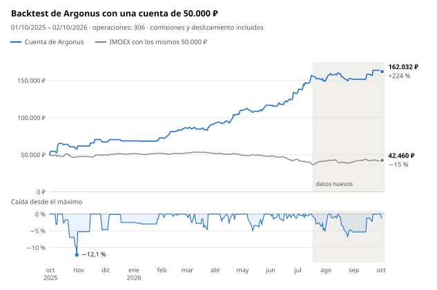

# argonus-moex

[](README.md) [](README.en.md) [](README.zh-CN.md) [](README.pt-BR.md) [](README.ja.md) [](README.ko.md) [](README.de.md)

[](https://hits.sh/github.com/Solrikk/argonus-moex/)

Argonus es un proyecto en Python para operar intradía con acciones de la Bolsa de
Moscú (MOEX) a través de la API de T-Invest. Cada mañana, el bot elige una operación
de su lista de seguimiento, entra a las 07:05 (hora de Moscú) según el libro de
órdenes y coloca de inmediato un stop y un take profit. Hasta las 09:30 añade
operaciones de un escáner que revisa todas las acciones líquidas. Las posiciones se
cierran el mismo día. El repositorio también incluye los backtests y las
investigaciones con los que se eligieron las reglas.

## Resultados del backtest

<picture>
  <source media="(prefers-color-scheme: dark)" srcset="docs/assets/backtest/equity-es-dark.svg">
  
</picture>

El backtest mantiene una sola cuenta de 50.000 ₽ durante todas las sesiones del
1 de octubre de 2025 al 2 de octubre de 2026, sin aportes ni reinicios. Reproduce
la configuración actual de [`scripts/run_tick.sh`](scripts/run_tick.sh): la entrada
de las 07:05 y el escáner matutino. Ya se descuentan una comisión del 0,04 % y un
deslizamiento del 0,05 % en cada lado de cada operación.

| Métrica | Valor |
| --- | ---: |
| Saldo final | **162.032 ₽ (+224,1 %)** |
| Operaciones | 306, el 49,7 % con ganancia |
| Caída máxima | −12,1 % al cierre diario, −17,8 % con los peores precios intradía |
| Solo la entrada de las 07:05, sin escáner | 136.495 ₽ (+173,0 %) |
| IMOEX en el mismo periodo | −15,1 % |

<details>
<summary>Resultados por mes</summary>

| Mes | Resultado | Rentabilidad | Operaciones | Del escáner | Ganadoras |
| --- | ---: | ---: | ---: | ---: | ---: |
| Octubre de 2025 | +11.731 ₽ | +23,5 % | 11 | 0 | 5 |
| Noviembre de 2025 | +5.450 ₽ | +8,8 % | 5 | 0 | 3 |
| Diciembre de 2025 | +1.475 ₽ | +2,2 % | 3 | 0 | 2 |
| Enero de 2026 | +4.101 ₽ | +6,0 % | 4 | 0 | 2 |
| Febrero de 2026 | +13.596 ₽ | +18,7 % | 28 | 24 | 18 |
| Marzo de 2026 | +5.453 ₽ | +6,3 % | 46 | 42 | 20 |
| Abril de 2026 | +17.988 ₽ | +19,6 % | 37 | 28 | 21 |
| Mayo de 2026 | +7.051 ₽ | +6,4 % | 32 | 24 | 18 |
| Junio de 2026 | +15.728 ₽ | +13,5 % | 52 | 44 | 24 |
| Julio de 2026 | +16.280 ₽ | +12,3 % | 49 | 36 | 20 |
| Agosto de 2026 | +2.763 ₽ | +1,9 % | 34 | 24 | 16 |
| Septiembre de 2026 | +12.111 ₽ | +8,0 % | 4 | 1 | 3 |
| 1–2 de octubre de 2026 | −1.696 ₽ | −1,0 % | 1 | 0 | 0 |

La rentabilidad de cada mes se calcula sobre el saldo al inicio de ese mes.

</details>

> [!WARNING]
> Los resultados del backtest no garantizan rentabilidades futuras y no constituyen
> asesoramiento de inversión.

## Cómo funciona la estrategia

1. **Lista de seguimiento.** [`generate_watchlist`](argonus/watchlists/generate_watchlist.py)
   analiza las acciones de TQBR con velas diarias y selecciona tres candidatos
   largos y tres cortos con objetivos T1–T4.
2. **Selección a las 07:00 (hora de Moscú).** El analizador ordena los candidatos.
   La entrada principal se omite si su dirección no coincide con el régimen del
   mercado (largos solo con el IMOEX por encima de su EMA20, cortos solo por debajo),
   si un candidato a corto subió más de un 8 % en 10 días o si el objetivo T4 está a
   menos del 2 %, es decir, a menos de dos stops. El selector RS5 toma el primero de
   los tres mejores candidatos cuya fuerza relativa frente al índice en cinco días no
   sea peor que −2,39 puntos porcentuales.
3. **Entrada a las 07:05.** Tras la primera vela completa de cinco minutos, el bot
   envía una única orden FOK. Un libro de órdenes de profundidad 50 debe cubrir todo
   el volumen y no tener más de 3 segundos, y el precio medio de ejecución debe estar
   a no más del 0,1 % del mejor precio.
4. **Salida.** El stop está a un 1 % del precio de entrada. El take profit está un
   25 % más lejos que el objetivo T4, medido desde el precio real de ejecución. A las
   18:35 la posición se cierra en cualquier caso.
5. **Escáner matutino.** De 07:20 a 09:30, cada 5 minutos, revisa todas las acciones
   líquidas en busca de un impulso matutino que continúa, un impulso agotado y un
   hueco que se está cerrando. Dos modelos, una regresión ridge y un gradient
   boosting poco profundo, predicen la rentabilidad de cada operación después de
   costes. Entra cuando la previsión media es de al menos +0,15 %, con un stop del
   1 % y un objetivo del 2 %. Los modelos se reentrenan cada mes solo con datos
   pasados.
6. **Límites compartidos.** Como máximo tres posiciones a la vez, 150.000 ₽ en total
   y no más de 3× el capital. El riesgo conjunto de los stops se limita al 3 % del
   capital y, tras una pérdida diaria del 3 %, no se abren nuevas entradas.

Tras la ejecución, el bot registra el precio real y coloca primero STOP_LOSS y
después TAKE_PROFIT. Las respuestas perdidas del bróker se concilian por el
identificador de la orden, y las órdenes FOK nunca se reenvían.

## Estructura del proyecto

```text
argonus/
  trading/       Bot de trading y ejecución de órdenes
  strategies/    Señales y reglas de riesgo
  watchlists/    Generación de listas y selección de candidatos
  market_data/   Datos de mercado de MOEX y T-Invest
  models/        Código de modelos predictivos
  shadow/        Recopilación de datos y evaluación de experimentos en modo sombra
  backtesting/   Simulaciones históricas
  research/      Investigación de estrategias
  training/      Entrenamiento de modelos
  runtime/       Programador de ciclos de ejecución
config/          Configuración de experimentos en modo sombra y plantillas de activación
scripts/         Scripts de inicio, validación local y gráficos del README
tests/           Pruebas
docs/assets/     Botones de idioma y gráficos del backtest
data/            Datos de mercado e informes locales
models/          Modelos entrenados locales
runtime/         Registros y estado local del bot
```

## Instalación

Requiere Python 3.10 o posterior. Ejecuta los comandos desde la raíz del proyecto.

```bash
python3 -m venv .venv
source .venv/bin/activate
python -m pip install -e '.[research]'
```

## Validación

```bash
python -m unittest discover -s tests -t .
./run_candidate.sh --dry-run --once
python -m argonus.trading.trade_bot --help
python -m argonus.watchlists.generate_watchlist --help
```

Las pruebas utilizan respuestas simuladas del bróker y archivos temporales.
Las comprobaciones que dependen de archivos históricos, modelos guardados o
manifiestos de activación locales se omiten cuando faltan los archivos
necesarios. Estos archivos no se incluyen en el repositorio público.

## Acceso a los datos

```bash
cp .tbank_token.example .tbank_token
chmod 600 .tbank_token
```

El archivo `.tbank_token` contiene el marcador `YOUR_TBANK_API_TOKEN_HERE`.
Sustitúyelo por tu propio token para utilizar T-Invest. También se admite la
variable de entorno `TINVEST_TOKEN`. Guarda tu token real solo de forma local:
`.tbank_token` y `.env` están excluidos de Git. Configura el nombre de la cuenta
del bróker mediante `BOT_ACCOUNT_NAME`; su valor de ejemplo es `YOUR_ACCOUNT_NAME`.

Para generar una lista de seguimiento con datos de mercado descargados:

```bash
python -m argonus.watchlists.generate_watchlist -o data/watchlists/watchlist.txt
```

## Ejecución del bot

```bash
./run_tick.sh                        # un ciclo sin enviar órdenes
./run_tick.sh --live                 # un ciclo con órdenes reales
./run_candidate.sh --dry-run --once  # comprobar la programación sin contactar con el bróker
```

El bucle `./run_candidate.sh` ejecuta un ciclo cada 30 segundos los días
laborables, de 06:50 a 23:45 (hora de Moscú). Llama a `run_tick.sh` sin `--live`,
por lo que no envía órdenes. Un archivo `PAUSE` en la raíz del proyecto detiene los
ciclos. Las solicitudes de datos pueden requerir un token y una cuenta.

La versión pública solo contiene plantillas inactivas de manifiestos de
activación para producción en `config/*activation_manifest.example.json`.
Estas muestran la estructura de la configuración y requieren tus propios
artefactos, sumas de comprobación y ajustes. Los manifiestos de experimentos
en modo sombra funcionan únicamente en modo `shadow_only`.

## Cómo reproducir el backtest

El backtest necesita archivos locales de velas y conjuntos de datos preparados en
`data/`, que no se incluyen en el repositorio público. Con ellos disponibles:

```bash
python -m argonus.backtesting.backtest_opening_all_months
python -m scripts.render_backtest_chart
```

El primer comando escribe `data/backtests/opening_integration_2026-10-03/all_months.json`
y `all_months.csv`. El segundo vuelve a dibujar los gráficos de `docs/assets/backtest/`
para todos los idiomas del README. El script `scripts/validate_opening_integration.py`
comprueba los manifiestos de producción y los modelos en esa misma instalación local.

## Desarrollo

Añade nuevas investigaciones a `argonus/research/` y pruebas a `tests/`.
Utiliza `argonus.paths` para obtener las rutas de los datos. Ejecuta el código
como un módulo de Python: `python -m argonus.<package>.<module>`.
