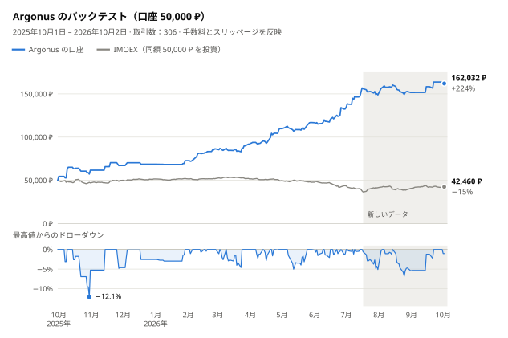

# argonus-moex

[](README.md) [](README.en.md) [](README.zh-CN.md) [](README.es.md) [](README.pt-BR.md) [](README.ko.md) [](README.de.md)

[](https://hits.sh/github.com/Solrikk/argonus-moex/)

Argonus は、T-Invest API を通じてモスクワ証券取引所（MOEX）の株式をデイトレードする Python プロジェクトです。ボットは毎朝ウォッチリストから取引を 1 つ選び、モスクワ時間 07:05 に板情報を確認してエントリーし、すぐにストップと利確注文を置きます。09:30 までは、流動性の高い全銘柄を調べるスキャナーで取引を追加します。ポジションはその日のうちに決済します。リポジトリには、ルールを決めるために使ったバックテストと研究も含まれています。

## バックテスト結果

<picture>
  <source media="(prefers-color-scheme: dark)" srcset="docs/assets/backtest/equity-ja-dark.svg">
  
</picture>

バックテストでは、50,000 ₽ の口座 1 つを、入金やリセットなしで 2025年10月1日から 2026年10月2日までのすべての取引日にわたって運用します。現在の [`scripts/run_tick.sh`](scripts/run_tick.sh) の設定、つまり 07:05 のエントリーと朝のスキャナーを再現しています。各取引の売買それぞれについて、手数料 0.04% とスリッページ 0.05% を差し引き済みです。

| 指標 | 値 |
| --- | ---: |
| 最終残高 | **162,032 ₽ (+224.1%)** |
| 取引数 | 306（勝率 49.7%） |
| 最大ドローダウン | 日次終値ベースで −12.1%、日中の最も不利な価格では −17.8% |
| 07:05 のエントリーのみ（スキャナーなし） | 136,495 ₽ (+173.0%) |
| 同期間の IMOEX | −15.1% |

<details>
<summary>月別の結果</summary>

| 月 | 損益 | リターン | 取引数 | うちスキャナー | 勝ち取引 |
| --- | ---: | ---: | ---: | ---: | ---: |
| 2025年10月 | +11,731 ₽ | +23.5% | 11 | 0 | 5 |
| 2025年11月 | +5,450 ₽ | +8.8% | 5 | 0 | 3 |
| 2025年12月 | +1,475 ₽ | +2.2% | 3 | 0 | 2 |
| 2026年1月 | +4,101 ₽ | +6.0% | 4 | 0 | 2 |
| 2026年2月 | +13,596 ₽ | +18.7% | 28 | 24 | 18 |
| 2026年3月 | +5,453 ₽ | +6.3% | 46 | 42 | 20 |
| 2026年4月 | +17,988 ₽ | +19.6% | 37 | 28 | 21 |
| 2026年5月 | +7,051 ₽ | +6.4% | 32 | 24 | 18 |
| 2026年6月 | +15,728 ₽ | +13.5% | 52 | 44 | 24 |
| 2026年7月 | +16,280 ₽ | +12.3% | 49 | 36 | 20 |
| 2026年8月 | +2,763 ₽ | +1.9% | 34 | 24 | 16 |
| 2026年9月 | +12,111 ₽ | +8.0% | 4 | 1 | 3 |
| 2026年10月1–2日 | −1,696 ₽ | −1.0% | 1 | 0 | 0 |

各月のリターンは、その月の初めの口座残高を基準に計算しています。

</details>

> [!WARNING]
> バックテストの結果は将来のリターンを保証するものではなく、投資助言でもありません。

## 戦略の仕組み

1. **ウォッチリスト。** [`generate_watchlist`](argonus/watchlists/generate_watchlist.py) が TQBR の株式を日足で調べ、ロングとショートの候補を 3 銘柄ずつ、目標値 T1〜T4 とともに選びます。
2. **モスクワ時間 07:00 の取引選定。** アナライザーが候補を順位付けします。方向が市場レジームと合わない場合（ロングは IMOEX が EMA20 より上のときだけ、ショートは下のときだけ）、ショート候補が 10 日間で 8% 超上昇している場合、または目標 T4 まで 2% 未満（ストップ 2 回分未満）の場合は、メインのエントリーを見送ります。RS5 セレクターは、上位 3 候補のうち、指数に対する 5 日間の相対力が −2.39 ポイント以上の最初の候補を選びます。
3. **07:05 のエントリー。** 最初の 5 分足が確定したあと、ボットは FOK 注文を 1 回だけ送ります。深さ 50 の板が注文数量全体をカバーし、3 秒以内の新しい板であること、平均約定価格が最良価格から 0.1% 以内であることが条件です。
4. **エグジット。** ストップはエントリー価格から 1%。利確は、実際の約定価格から見て目標 T4 より 25% 遠くに置きます。18:35 になるとポジションは必ず決済されます。
5. **朝のスキャナー。** 07:20 から 09:30 まで 5 分ごとに、流動性の高い全銘柄で朝の値動きの継続、値動きの失速、まだ埋まっていないギャップを調べます。リッジ回帰と浅い勾配ブースティングの 2 つのモデルが、コスト控除後の取引リターンを予測します。予測の平均が +0.15% 以上ならエントリーし、ストップは 1%、目標は 2% です。モデルは毎月、過去のデータだけで再学習します。
6. **共通の上限。** 同時に保有するのは最大 3 ポジション、合計 150,000 ₽ まで、かつ資産の 3 倍までです。全ストップのリスク合計は資産の 3% までで、1 日の損失が 3% に達すると新規エントリーを停止します。

約定後、ボットは実際の約定価格を記録し、STOP_LOSS、続いて TAKE_PROFIT を発注します。失われた証券会社の応答は注文 ID で照合し、FOK 注文を再送することはありません。

## プロジェクト構成

```text
argonus/
  trading/       取引ボットと注文執行
  strategies/    シグナルとリスク管理ルール
  watchlists/    ウォッチリストの生成と候補の選定
  market_data/   MOEX と T-Invest の市場データ
  models/        予測モデルのコード
  shadow/        シャドー実験のデータ収集と評価
  backtesting/   過去データによるシミュレーション
  research/      取引戦略の研究
  training/      モデルの学習
  runtime/       Tick 実行のスケジューラー
config/          シャドー実験の設定と有効化用テンプレート
scripts/         起動スクリプト、ローカル検証、README のグラフ
tests/           テスト
docs/assets/     言語ボタンとバックテストのグラフ
data/            ローカルの市場データとレポート
models/          ローカルの学習済みモデル
runtime/         ローカルのログとボットの状態
```

## インストール

Python 3.10 以降が必要です。コマンドはプロジェクトのルートディレクトリで実行してください。

```bash
python3 -m venv .venv
source .venv/bin/activate
python -m pip install -e '.[research]'
```

## 検証

```bash
python -m unittest discover -s tests -t .
./run_candidate.sh --dry-run --once
python -m argonus.trading.trade_bot --help
python -m argonus.watchlists.generate_watchlist --help
```

テストでは、証券会社の模擬レスポンスと一時ファイルを使用します。履歴アーカイブ、保存済みモデル、ローカルの有効化マニフェストに依存する検証は、必要なファイルが存在しない場合にスキップされます。これらのファイルは公開リポジトリに含まれていません。

## データへのアクセス

```bash
cp .tbank_token.example .tbank_token
chmod 600 .tbank_token
```

`.tbank_token` ファイルにはプレースホルダー `YOUR_TBANK_API_TOKEN_HERE` が入っています。T-Invest を使用するには、自分のトークンに置き換えてください。環境変数 `TINVEST_TOKEN` も使用できます。実際のトークンはローカルにのみ保存してください：`.tbank_token` と `.env` は Git の管理対象から除外されています。証券会社の口座名は `BOT_ACCOUNT_NAME` で設定します。プレースホルダー値は `YOUR_ACCOUNT_NAME` です。

取得した市場データを使ってウォッチリストを生成するには、次のコマンドを実行します。

```bash
python -m argonus.watchlists.generate_watchlist -o data/watchlists/watchlist.txt
```

## ボットの実行

```bash
./run_tick.sh                        # 注文を出さずに 1 回実行
./run_tick.sh --live                 # 実際の注文ありで 1 回実行
./run_candidate.sh --dry-run --once  # 証券会社に接続せずにスケジュールを確認
```

`./run_candidate.sh` のループは、平日のモスクワ時間 06:50〜23:45 に 30 秒ごとに Tick を実行します。`run_tick.sh` を `--live` なしで呼び出すため、注文は出しません。プロジェクトのルートに `PAUSE` ファイルを置くと Tick が止まります。データのリクエストにはトークンと口座が必要になる場合があります。

公開版の本番環境用の有効化マニフェストは、`config/*activation_manifest.example.json` にある、まだ有効化されていないテンプレートのみです。これらは設定の構造を示しており、利用するには自分の成果物、チェックサム、設定が必要です。シャドー実験のマニフェストは `shadow_only` モードでのみ動作します。

## バックテストの再現

バックテストには、ローカルのローソク足アーカイブと `data/` 内の準備済みデータセットが必要です。これらは公開リポジトリには含まれていません。揃っている場合は次を実行します。

```bash
python -m argonus.backtesting.backtest_opening_all_months
python -m scripts.render_backtest_chart
```

1 つ目のコマンドは `data/backtests/opening_integration_2026-10-03/all_months.json` と `all_months.csv` を書き出します。2 つ目は README の全言語向けに `docs/assets/backtest/` のグラフを描き直します。`scripts/validate_opening_integration.py` は、同じローカル環境で本番用のマニフェストとモデルを検証します。

## 開発

新しい研究は `argonus/research/` に、テストは `tests/` に追加してください。データパスは `argonus.paths` を使って取得してください。コードは Python モジュールとして実行します：`python -m argonus.<package>.<module>`。
