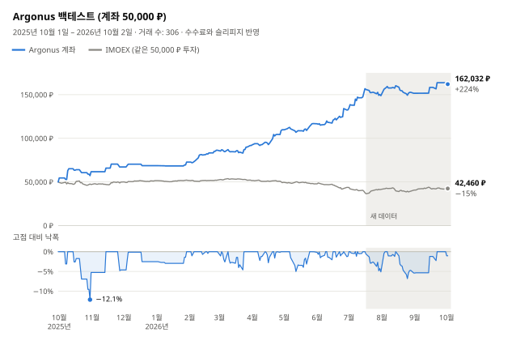

# argonus-moex

[](README.md) [](README.en.md) [](README.zh-CN.md) [](README.es.md) [](README.pt-BR.md) [](README.ja.md) [](README.de.md)

[](https://hits.sh/github.com/Solrikk/argonus-moex/)

Argonus는 T-Invest API를 통해 모스크바 거래소(MOEX) 주식을 장중 거래하는 Python
프로젝트입니다. 봇은 매일 아침 관심 종목 목록에서 거래를 하나 고르고, 모스크바 시간
07:05에 호가창을 확인해 진입한 뒤 곧바로 손절과 익절 주문을 걸어 둡니다. 09:30까지는
유동성이 높은 모든 종목을 살피는 스캐너로 거래를 추가합니다. 포지션은 당일에
청산합니다. 저장소에는 규칙을 정하는 데 사용한 백테스트와 연구 자료도 들어 있습니다.

## 백테스트 결과

<picture>
  <source media="(prefers-color-scheme: dark)" srcset="docs/assets/backtest/equity-ko-dark.svg">
  
</picture>

백테스트는 50,000 ₽ 계좌 하나를 입금이나 초기화 없이 2025년 10월 1일부터
2026년 10월 2일까지의 모든 거래일에 걸쳐 운용합니다. 현재
[`scripts/run_tick.sh`](scripts/run_tick.sh) 설정, 즉 07:05 진입과 아침 스캐너를
그대로 재현합니다. 거래마다 매수와 매도 각각에 수수료 0.04%와 슬리피지 0.05%를 이미
차감했습니다.

| 지표 | 값 |
| --- | ---: |
| 최종 잔고 | **162,032 ₽ (+224.1%)** |
| 거래 수 | 306건, 수익 거래 49.7% |
| 최대 낙폭 | 일별 종가 기준 −12.1%, 장중 가장 불리한 가격 기준 −17.8% |
| 07:05 진입만, 스캐너 제외 | 136,495 ₽ (+173.0%) |
| 같은 기간 IMOEX | −15.1% |

<details>
<summary>월별 결과</summary>

| 월 | 손익 | 수익률 | 거래 수 | 스캐너 거래 | 수익 거래 |
| --- | ---: | ---: | ---: | ---: | ---: |
| 2025년 10월 | +11,731 ₽ | +23.5% | 11 | 0 | 5 |
| 2025년 11월 | +5,450 ₽ | +8.8% | 5 | 0 | 3 |
| 2025년 12월 | +1,475 ₽ | +2.2% | 3 | 0 | 2 |
| 2026년 1월 | +4,101 ₽ | +6.0% | 4 | 0 | 2 |
| 2026년 2월 | +13,596 ₽ | +18.7% | 28 | 24 | 18 |
| 2026년 3월 | +5,453 ₽ | +6.3% | 46 | 42 | 20 |
| 2026년 4월 | +17,988 ₽ | +19.6% | 37 | 28 | 21 |
| 2026년 5월 | +7,051 ₽ | +6.4% | 32 | 24 | 18 |
| 2026년 6월 | +15,728 ₽ | +13.5% | 52 | 44 | 24 |
| 2026년 7월 | +16,280 ₽ | +12.3% | 49 | 36 | 20 |
| 2026년 8월 | +2,763 ₽ | +1.9% | 34 | 24 | 16 |
| 2026년 9월 | +12,111 ₽ | +8.0% | 4 | 1 | 3 |
| 2026년 10월 1–2일 | −1,696 ₽ | −1.0% | 1 | 0 | 0 |

각 월의 수익률은 그달 초 계좌 잔고를 기준으로 계산합니다.

</details>

> [!WARNING]
> 백테스트 결과는 미래 수익을 보장하지 않으며 투자 조언이 아닙니다.

## 전략 작동 방식

1. **관심 종목 목록.** [`generate_watchlist`](argonus/watchlists/generate_watchlist.py)가
   TQBR 주식을 일봉으로 검사해 롱과 숏 후보를 3개씩, 목표가 T1–T4와 함께 고릅니다.
2. **모스크바 시간 07:00 거래 선정.** 분석기가 후보의 순위를 매깁니다. 방향이 시장
   국면과 맞지 않거나(롱은 IMOEX가 EMA20 위일 때만, 숏은 아래일 때만), 숏 후보가
   10일 동안 8% 넘게 올랐거나, 목표 T4까지 2% 미만, 즉 손절 폭의 두 배 미만이면 주
   진입을 건너뜁니다. RS5 선택기는 상위 3개 후보 중 지수 대비 5일 상대 강도가
   −2.39%p 이상인 첫 번째 후보를 고릅니다.
3. **07:05 진입.** 첫 5분봉이 완성되면 봇은 FOK 주문을 한 번만 보냅니다. 깊이 50의
   호가창이 전체 수량을 감당하고 3초 이내의 최신 데이터여야 하며, 평균 체결가가
   최우선 호가에서 0.1% 이내여야 합니다.
4. **청산.** 손절은 진입가에서 1%입니다. 익절은 실제 체결가에서 잰 거리가 목표 T4보다
   25% 더 먼 곳에 둡니다. 18:35가 되면 포지션은 무조건 청산됩니다.
5. **아침 스캐너.** 07:20부터 09:30까지 5분마다 유동성이 높은 모든 종목에서 아침
   움직임의 지속, 움직임의 소진, 아직 메워지지 않은 갭을 찾습니다. 리지 회귀와 얕은
   그래디언트 부스팅, 두 모델이 비용 차감 후 거래 수익률을 예측합니다. 평균 예측이
   +0.15% 이상이면 진입하며, 손절은 1%, 목표는 2%입니다. 모델은 매달 과거 데이터만으로
   다시 학습합니다.
6. **공통 한도.** 동시에 최대 3개 포지션, 합계 150,000 ₽까지, 자산의 3배 이내입니다.
   모든 손절의 위험 합계는 자산의 3%로 제한되며, 하루 손실이 3%에 이르면 새 진입을
   멈춥니다.

체결 후 봇은 실제 체결가를 기록하고 STOP_LOSS, 이어서 TAKE_PROFIT 주문을 넣습니다.
유실된 증권사 응답은 주문 ID로 대조하며, FOK 주문은 다시 보내지 않습니다.

## 프로젝트 구조

```text
argonus/
  trading/       트레이딩 봇과 주문 실행
  strategies/    신호와 위험 관리 규칙
  watchlists/    관심 종목 목록 생성과 후보 종목 선정
  market_data/   MOEX 및 T-Invest 시장 데이터
  models/        예측 모델 코드
  shadow/        섀도 실험 데이터 수집 및 평가
  backtesting/   과거 데이터 시뮬레이션
  research/      전략 연구
  training/      모델 학습
  runtime/       Tick 실행 스케줄러
config/          섀도 실험 설정과 활성화 템플릿
scripts/         실행 스크립트, 로컬 검증, README 그래프
tests/           테스트
docs/assets/     언어 버튼과 백테스트 그래프
data/            로컬 시장 데이터와 보고서
models/          로컬에 저장된 학습 모델
runtime/         로컬 로그와 봇 상태
```

## 설치

Python 3.10 이상이 필요합니다. 프로젝트 루트 디렉터리에서 명령을 실행하세요.

```bash
python3 -m venv .venv
source .venv/bin/activate
python -m pip install -e '.[research]'
```

## 검증

```bash
python -m unittest discover -s tests -t .
./run_candidate.sh --dry-run --once
python -m argonus.trading.trade_bot --help
python -m argonus.watchlists.generate_watchlist --help
```

테스트는 모의 증권사 응답과 임시 파일을 사용합니다. 과거 데이터 아카이브,
저장된 모델 또는 로컬 활성화 매니페스트에 의존하는 검증은 필요한 파일이 없으면
건너뜁니다. 이러한 파일은 공개 저장소에 포함되어 있지 않습니다.

## 데이터 접근

```bash
cp .tbank_token.example .tbank_token
chmod 600 .tbank_token
```

`.tbank_token` 파일에는 자리표시자 `YOUR_TBANK_API_TOKEN_HERE`가 들어 있습니다.
T-Invest를 사용하려면 본인의 토큰으로 바꾸세요. 환경 변수 `TINVEST_TOKEN`도
지원합니다. 실제 토큰은 로컬에만 저장하세요. `.tbank_token`과 `.env`는 Git 관리
대상에서 제외됩니다. 증권사 계좌 이름은 `BOT_ACCOUNT_NAME`으로 설정하며,
자리표시자 값은 `YOUR_ACCOUNT_NAME`입니다.

다운로드한 시장 데이터로 관심 종목 목록을 생성하려면 다음 명령을 실행하세요.

```bash
python -m argonus.watchlists.generate_watchlist -o data/watchlists/watchlist.txt
```

## 봇 실행

```bash
./run_tick.sh                        # 주문 없이 한 번 실행
./run_tick.sh --live                 # 실제 주문으로 한 번 실행
./run_candidate.sh --dry-run --once  # 증권사에 연결하지 않고 일정 확인
```

`./run_candidate.sh` 루프는 평일 모스크바 시간 06:50~23:45에 30초마다 Tick을
실행합니다. `run_tick.sh`를 `--live` 없이 호출하므로 주문을 내지 않습니다. 프로젝트
루트에 `PAUSE` 파일을 두면 Tick이 멈춥니다. 데이터 요청에 토큰과 계좌가 필요할 수
있습니다.

공개 버전에는 `config/*activation_manifest.example.json`에 비활성 상태인
실거래 활성화 매니페스트 템플릿만 포함되어 있습니다. 이 템플릿은 설정 구조를
보여 주며, 본인의 아티팩트, 체크섬 및 별도 설정이 필요합니다.
섀도 실험 매니페스트는 `shadow_only` 모드에서만 동작합니다.

## 백테스트 재현

백테스트에는 로컬 캔들 아카이브와 `data/`의 준비된 데이터 세트가 필요하며, 이 파일들은
공개 저장소에 포함되어 있지 않습니다. 파일이 준비되어 있다면 다음을 실행합니다.

```bash
python -m argonus.backtesting.backtest_opening_all_months
python -m scripts.render_backtest_chart
```

첫 번째 명령은 `data/backtests/opening_integration_2026-10-03/all_months.json`과
`all_months.csv`를 기록합니다. 두 번째 명령은 모든 README 언어용으로
`docs/assets/backtest/`의 그래프를 다시 그립니다. `scripts/validate_opening_integration.py`는
같은 로컬 환경에서 실거래 매니페스트와 모델을 검증합니다.

## 개발

새로운 연구는 `argonus/research/`에, 테스트는 `tests/`에 추가하세요.
데이터 경로는 `argonus.paths`를 사용해 가져오세요. 코드는 Python 모듈로 실행합니다.
`python -m argonus.<package>.<module>`.
