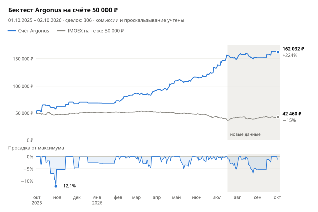

# argonus-moex

[](README.en.md) [](README.zh-CN.md) [](README.es.md) [](README.pt-BR.md) [](README.ja.md) [](README.ko.md) [](README.de.md)

[](https://hits.sh/github.com/Solrikk/argonus-moex/)

Argonus — Python-проект для внутридневной торговли акциями Московской биржи
через T-Invest API. Каждое утро бот выбирает сделку из вотчлиста, входит в 07:05 МСК
по стакану и сразу ставит стоп и тейк. До 09:30 он добирает сделки сканером
по всем ликвидным акциям. Позиции закрываются в тот же день. В репозитории также
лежат бектесты и исследования, на которых подбирались правила.

## Результаты бектеста

<picture>
  <source media="(prefers-color-scheme: dark)" srcset="docs/assets/backtest/equity-ru-dark.svg">
  
</picture>

Бектест ведёт один счёт с 50 000 ₽ через все торговые дни с 1 октября 2025
по 2 октября 2026 года, без пополнений и перезапусков. Он повторяет текущую
конфигурацию [`scripts/run_tick.sh`](scripts/run_tick.sh): вход в 07:05 и утренний
сканер. Комиссия 0,04% и проскальзывание 0,05% на каждую сторону сделки уже вычтены.

| Показатель | Значение |
| --- | ---: |
| Итоговый счёт | **162 032 ₽ (+224,1%)** |
| Сделок | 306, прибыльных 49,7% |
| Максимальная просадка | −12,1% по закрытию дня, −17,8% по худшим ценам внутри дня |
| Только вход в 07:05, без сканера | 136 495 ₽ (+173,0%) |
| IMOEX за тот же период | −15,1% |

<details>
<summary>Результаты по месяцам</summary>

| Месяц | Результат | Доходность | Сделок | Из них сканер | Прибыльных |
| --- | ---: | ---: | ---: | ---: | ---: |
| Октябрь 2025 | +11 731 ₽ | +23,5% | 11 | 0 | 5 |
| Ноябрь 2025 | +5 450 ₽ | +8,8% | 5 | 0 | 3 |
| Декабрь 2025 | +1 475 ₽ | +2,2% | 3 | 0 | 2 |
| Январь 2026 | +4 101 ₽ | +6,0% | 4 | 0 | 2 |
| Февраль 2026 | +13 596 ₽ | +18,7% | 28 | 24 | 18 |
| Март 2026 | +5 453 ₽ | +6,3% | 46 | 42 | 20 |
| Апрель 2026 | +17 988 ₽ | +19,6% | 37 | 28 | 21 |
| Май 2026 | +7 051 ₽ | +6,4% | 32 | 24 | 18 |
| Июнь 2026 | +15 728 ₽ | +13,5% | 52 | 44 | 24 |
| Июль 2026 | +16 280 ₽ | +12,3% | 49 | 36 | 20 |
| Август 2026 | +2 763 ₽ | +1,9% | 34 | 24 | 16 |
| Сентябрь 2026 | +12 111 ₽ | +8,0% | 4 | 1 | 3 |
| 1–2 октября 2026 | −1 696 ₽ | −1,0% | 1 | 0 | 0 |

Доходность месяца считается от счёта на начало месяца.

</details>

> [!WARNING]
> Бектест не гарантирует такой же доходности в будущем и не является
> инвестиционной рекомендацией.

## Как устроена стратегия

1. **Вотчлист.** [`generate_watchlist`](argonus/watchlists/generate_watchlist.py)
   проверяет акции TQBR по дневным свечам и отбирает по три кандидата в лонг
   и в шорт с целями T1–T4.
2. **Выбор сделки в 07:00 МСК.** Анализатор ранжирует кандидатов. Основной вход
   пропускается, если направление расходится с режимом рынка (лонг — только когда
   IMOEX выше EMA20, шорт — только когда ниже), если бумага для шорта выросла больше
   чем на 8% за 10 дней или если цель T4 ближе 2%, то есть меньше двух стопов.
   Селектор RS5 берёт первого из трёх лучших кандидатов, чья относительная сила
   к индексу за пять дней не хуже −2,39 п.п.
3. **Вход в 07:05.** После первой полной пятиминутной свечи бот отправляет одну
   FOK-заявку. Стакан глубиной 50 должен покрывать весь объём и быть не старше
   3 секунд, а средняя цена исполнения — отличаться от лучшей не больше чем на 0,1%.
4. **Выход.** Стоп — 1% от цены входа. Тейк стоит на 25% дальше цели T4, если
   считать от фактической цены входа. В 18:35 позиция закрывается в любом случае.
5. **Утренний сканер.** С 07:20 до 09:30 каждые 5 минут он проверяет все ликвидные
   акции: продолжение утреннего импульса, его истощение и закрытие гэпа. Две модели —
   ridge и неглубокий бустинг — прогнозируют доходность сделки после издержек.
   Вход — при среднем прогнозе от +0,15%, стоп 1%, цель 2%. Модели переобучаются
   каждый месяц только на прошлых данных.
6. **Общие лимиты.** Не больше трёх позиций одновременно, суммарно до 150 000 ₽
   и не больше 3× капитала. Риск всех стопов — до 3% капитала; после дневного
   убытка 3% новые входы прекращаются.

После исполнения бот сохраняет фактическую цену и ставит сначала STOP_LOSS,
потом TAKE_PROFIT. Потерянные ответы брокера сверяются по идентификатору заявки,
а FOK-заявки повторно не отправляются.

## Структура

```text
argonus/
  trading/       Торговый бот и исполнение заявок
  strategies/    Сигналы и правила риска
  watchlists/    Генерация и отбор кандидатов
  market_data/   Работа с MOEX и T-Invest
  models/        Код прогнозных моделей
  shadow/        Сбор и оценка теневых экспериментов
  backtesting/   Исторические симуляции
  research/      Исследования стратегий
  training/      Обучение моделей
  runtime/       Планировщик тиков
config/          Настройки теневых экспериментов и шаблоны активации
scripts/         Скрипты запуска, локальной проверки и графиков README
tests/           Тесты
docs/assets/     Кнопки языков и графики бектеста
data/            Локальные рыночные данные и отчёты
models/          Локальные обученные модели
runtime/         Локальные журналы и состояние бота
```

## Установка

Требуется Python 3.10 или новее. Команды выполняются из корня проекта.

```bash
python3 -m venv .venv
source .venv/bin/activate
python -m pip install -e '.[research]'
```

## Проверка

```bash
python -m unittest discover -s tests -t .
./run_candidate.sh --dry-run --once
python -m argonus.trading.trade_bot --help
python -m argonus.watchlists.generate_watchlist --help
```

Тесты используют поддельные ответы брокера и временные файлы. Проверки исторических
архивов, сохранённых моделей и локальных манифестов активации пропускаются, если
соответствующих файлов нет. Сами эти файлы в публичный репозиторий не включены.

## Доступ к данным

```bash
cp .tbank_token.example .tbank_token
chmod 600 .tbank_token
```

В `.tbank_token` находится шаблон `YOUR_TBANK_API_TOKEN_HERE` — замените его своим
токеном для работы с T-Invest. Также поддерживается переменная `TINVEST_TOKEN`.
Настоящий токен храните только локально: `.tbank_token` и `.env` исключены из Git.
Название брокерского счёта задаётся через `BOT_ACCOUNT_NAME`; значение шаблона —
`YOUR_ACCOUNT_NAME`.

Для генерации вотчлиста с загрузкой рыночных данных:

```bash
python -m argonus.watchlists.generate_watchlist -o data/watchlists/watchlist.txt
```

## Запуск бота

```bash
./run_tick.sh                        # один тик без выставления заявок
./run_tick.sh --live                 # один тик с реальными заявками
./run_candidate.sh --dry-run --once  # проверка расписания без обращения к брокеру
```

Цикл `./run_candidate.sh` запускает тик каждые 30 секунд по будням с 06:50
до 23:45 МСК. Он вызывает `run_tick.sh` без `--live`, поэтому заявок не выставляет.
Файл `PAUSE` в корне проекта останавливает тики. Для запросов данных могут
потребоваться токен и счёт.

Публичная копия содержит только неактивные шаблоны производственных манифестов
`config/*activation_manifest.example.json`. Они показывают структуру настроек,
но требуют собственных артефактов, контрольных сумм и отдельной настройки.
Манифесты теневых экспериментов работают только в режиме `shadow_only`.

## Как воспроизвести бектест

Бектесту нужны локальные архивы свечей и подготовленные наборы данных из `data/`,
которых нет в публичном репозитории. Когда они на месте:

```bash
python -m argonus.backtesting.backtest_opening_all_months
python -m scripts.render_backtest_chart
```

Первая команда записывает `data/backtests/opening_integration_2026-10-03/all_months.json`
и `all_months.csv`. Вторая перерисовывает графики в `docs/assets/backtest/` для всех
языков README. Скрипт `scripts/validate_opening_integration.py` проверяет
производственные манифесты и модели в такой же локальной установке.

## Разработка

Новые исследования добавляйте в `argonus/research/`, тесты — в `tests/`.
Пути к данным берите из `argonus.paths`. Код запускается как модуль:
`python -m argonus.<пакет>.<модуль>`.
