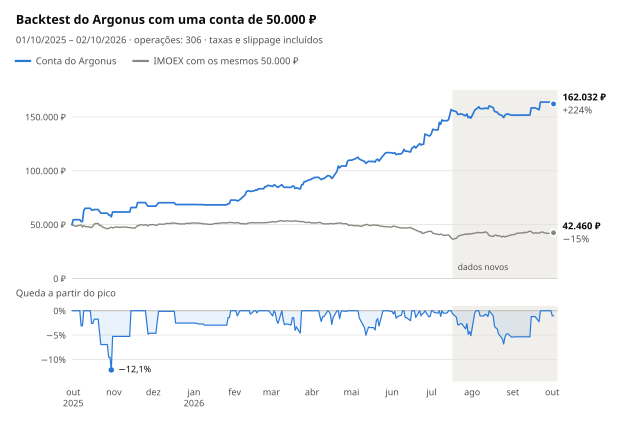

# argonus-moex

[](README.md) [](README.en.md) [](README.zh-CN.md) [](README.es.md) [](README.ja.md) [](README.ko.md) [](README.de.md)

[](https://hits.sh/github.com/Solrikk/argonus-moex/)

Argonus é um projeto em Python para operações intradiárias com ações da Bolsa de
Moscou (MOEX) pela API T-Invest. Toda manhã, o robô escolhe uma operação da lista de
acompanhamento, entra às 07:05 (horário de Moscou) com base no livro de ofertas e
coloca imediatamente um stop e um take profit. Até as 09:30, ele adiciona operações
de um scanner que verifica todas as ações líquidas. As posições são encerradas no
mesmo dia. O repositório também inclui os backtests e as pesquisas usados para
escolher as regras.

## Resultados do backtest

<picture>
  <source media="(prefers-color-scheme: dark)" srcset="docs/assets/backtest/equity-pt-BR-dark.svg">
  
</picture>

O backtest mantém uma única conta de 50.000 ₽ em todos os pregões de 1º de outubro
de 2025 a 2 de outubro de 2026, sem aportes nem reinícios. Ele reproduz a
configuração atual de [`scripts/run_tick.sh`](scripts/run_tick.sh): a entrada das
07:05 e o scanner matinal. Uma taxa de 0,04% e um slippage de 0,05% em cada ponta de
cada operação já foram descontados.

| Métrica | Valor |
| --- | ---: |
| Saldo final | **162.032 ₽ (+224,1%)** |
| Operações | 306, 49,7% com lucro |
| Drawdown máximo | −12,1% no fechamento diário, −17,8% nos piores preços intradiários |
| Só a entrada das 07:05, sem o scanner | 136.495 ₽ (+173,0%) |
| IMOEX no mesmo período | −15,1% |

<details>
<summary>Resultados por mês</summary>

| Mês | Resultado | Retorno | Operações | Do scanner | Vencedoras |
| --- | ---: | ---: | ---: | ---: | ---: |
| Outubro de 2025 | +11.731 ₽ | +23,5% | 11 | 0 | 5 |
| Novembro de 2025 | +5.450 ₽ | +8,8% | 5 | 0 | 3 |
| Dezembro de 2025 | +1.475 ₽ | +2,2% | 3 | 0 | 2 |
| Janeiro de 2026 | +4.101 ₽ | +6,0% | 4 | 0 | 2 |
| Fevereiro de 2026 | +13.596 ₽ | +18,7% | 28 | 24 | 18 |
| Março de 2026 | +5.453 ₽ | +6,3% | 46 | 42 | 20 |
| Abril de 2026 | +17.988 ₽ | +19,6% | 37 | 28 | 21 |
| Maio de 2026 | +7.051 ₽ | +6,4% | 32 | 24 | 18 |
| Junho de 2026 | +15.728 ₽ | +13,5% | 52 | 44 | 24 |
| Julho de 2026 | +16.280 ₽ | +12,3% | 49 | 36 | 20 |
| Agosto de 2026 | +2.763 ₽ | +1,9% | 34 | 24 | 16 |
| Setembro de 2026 | +12.111 ₽ | +8,0% | 4 | 1 | 3 |
| 1–2 de outubro de 2026 | −1.696 ₽ | −1,0% | 1 | 0 | 0 |

O retorno de cada mês é calculado sobre o saldo no início desse mês.

</details>

> [!WARNING]
> Resultados de backtest não garantem retornos futuros e não são recomendação de
> investimento.

## Como a estratégia funciona

1. **Lista de acompanhamento.** [`generate_watchlist`](argonus/watchlists/generate_watchlist.py)
   analisa as ações da TQBR com candles diários e seleciona três candidatos de
   compra e três de venda com alvos T1–T4.
2. **Escolha da operação às 07:00 (horário de Moscou).** O analisador ordena os
   candidatos. A entrada principal é cancelada quando sua direção diverge do regime
   de mercado (compra só com o IMOEX acima da EMA20, venda só abaixo), quando um
   candidato à venda subiu mais de 8% em 10 dias ou quando o alvo T4 está a menos de
   2%, ou seja, a menos de dois stops. O seletor RS5 escolhe o primeiro dos três
   melhores candidatos cuja força relativa ao índice em cinco dias não seja pior que
   −2,39 pontos percentuais.
3. **Entrada às 07:05.** Após o primeiro candle completo de cinco minutos, o robô
   envia uma única ordem FOK. Um livro de ofertas com profundidade 50 precisa cobrir
   todo o volume e ter no máximo 3 segundos, e o preço médio de execução deve ficar
   a no máximo 0,1% do melhor preço.
4. **Saída.** O stop fica a 1% do preço de entrada. O take profit fica 25% mais
   longe que o alvo T4, medido a partir do preço real de execução. Às 18:35 a
   posição é encerrada de qualquer forma.
5. **Scanner matinal.** Das 07:20 às 09:30, a cada 5 minutos, ele verifica todas as
   ações líquidas em busca de um impulso matinal que continua, de um impulso esgotado
   e de um gap em fechamento. Dois modelos, regressão ridge e gradient boosting raso,
   preveem o retorno de cada operação após os custos. A entrada ocorre quando a
   previsão média é de pelo menos +0,15%, com stop de 1% e alvo de 2%. Os modelos são
   retreinados todo mês apenas com dados passados.
6. **Limites compartilhados.** No máximo três posições ao mesmo tempo, 150.000 ₽ no
   total e não mais que 3× o patrimônio. O risco somado dos stops é limitado a 3% do
   patrimônio e, após uma perda diária de 3%, novas entradas são suspensas.

Após a execução, o robô registra o preço real e coloca primeiro STOP_LOSS e depois
TAKE_PROFIT. Respostas perdidas da corretora são conciliadas pelo identificador da
ordem, e ordens FOK nunca são reenviadas.

## Estrutura do projeto

```text
argonus/
  trading/       Robô de negociação e execução de ordens
  strategies/    Sinais e regras de risco
  watchlists/    Geração de listas e seleção de candidatos
  market_data/   Dados de mercado da MOEX e do T-Invest
  models/        Código dos modelos preditivos
  shadow/        Coleta de dados e avaliação de experimentos em modo sombra
  backtesting/   Simulações históricas
  research/      Pesquisa de estratégias
  training/      Treinamento de modelos
  runtime/       Agendador de ciclos de execução
config/          Configurações dos experimentos em modo sombra e modelos de ativação
scripts/         Scripts de inicialização, validação local e gráficos do README
tests/           Testes
docs/assets/     Botões de idioma e gráficos do backtest
data/            Dados de mercado e relatórios locais
models/          Modelos treinados locais
runtime/         Logs e estado local do robô
```

## Instalação

Requer Python 3.10 ou superior. Execute os comandos na raiz do projeto.

```bash
python3 -m venv .venv
source .venv/bin/activate
python -m pip install -e '.[research]'
```

## Validação

```bash
python -m unittest discover -s tests -t .
./run_candidate.sh --dry-run --once
python -m argonus.trading.trade_bot --help
python -m argonus.watchlists.generate_watchlist --help
```

Os testes usam respostas simuladas da corretora e arquivos temporários.
As verificações que dependem de dados históricos arquivados, modelos salvos ou
manifestos de ativação locais são ignoradas quando os arquivos necessários
não estão disponíveis. Esses arquivos não estão incluídos no repositório público.

## Acesso aos dados

```bash
cp .tbank_token.example .tbank_token
chmod 600 .tbank_token
```

O arquivo `.tbank_token` contém o valor de exemplo `YOUR_TBANK_API_TOKEN_HERE`.
Substitua-o pelo seu próprio token para usar o T-Invest. A variável de ambiente
`TINVEST_TOKEN` também é aceita. Mantenha seu token real apenas localmente:
`.tbank_token` e `.env` são excluídos do Git. Defina o nome da conta na corretora
pela variável `BOT_ACCOUNT_NAME`; seu valor de exemplo é `YOUR_ACCOUNT_NAME`.

Para gerar uma lista de acompanhamento com dados de mercado baixados:

```bash
python -m argonus.watchlists.generate_watchlist -o data/watchlists/watchlist.txt
```

## Execução do robô

```bash
./run_tick.sh                        # um ciclo sem enviar ordens
./run_tick.sh --live                 # um ciclo com ordens reais
./run_candidate.sh --dry-run --once  # verificar a programação sem acessar a corretora
```

O laço `./run_candidate.sh` executa um ciclo a cada 30 segundos nos dias úteis, das
06:50 às 23:45 (horário de Moscou). Ele chama `run_tick.sh` sem `--live`, portanto
não envia ordens. Um arquivo `PAUSE` na raiz do projeto interrompe os ciclos. As
solicitações de dados podem exigir um token e uma conta.

A versão pública contém apenas modelos inativos de manifestos de ativação
para produção em `config/*activation_manifest.example.json`. Eles mostram a
estrutura da configuração e exigem seus próprios artefatos, somas de verificação
e ajustes. Os manifestos de experimentos em modo sombra funcionam apenas no
modo `shadow_only`.

## Como reproduzir o backtest

O backtest precisa de arquivos locais de candles e de conjuntos de dados preparados
em `data/`, que não estão no repositório público. Com eles disponíveis:

```bash
python -m argonus.backtesting.backtest_opening_all_months
python -m scripts.render_backtest_chart
```

O primeiro comando grava `data/backtests/opening_integration_2026-10-03/all_months.json`
e `all_months.csv`. O segundo redesenha os gráficos em `docs/assets/backtest/` para
todos os idiomas do README. O script `scripts/validate_opening_integration.py`
verifica os manifestos de produção e os modelos nessa mesma instalação local.

## Desenvolvimento

Adicione novas pesquisas a `argonus/research/` e testes a `tests/`.
Use `argonus.paths` para obter os caminhos dos dados. Execute o código como
um módulo Python: `python -m argonus.<package>.<module>`.
