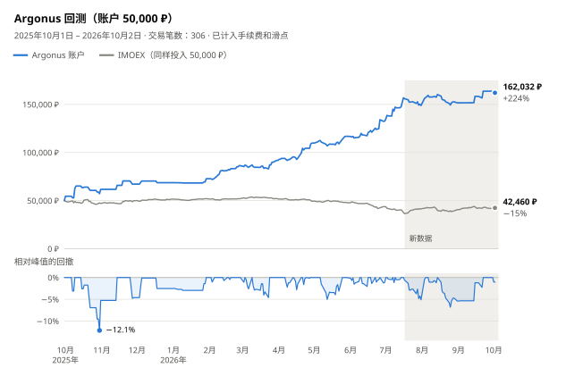

# argonus-moex

[](README.md) [](README.en.md) [](README.es.md) [](README.pt-BR.md) [](README.ja.md) [](README.ko.md) [](README.de.md)

[](https://hits.sh/github.com/Solrikk/argonus-moex/)

Argonus 是一个通过 T-Invest API 对莫斯科交易所（MOEX）股票进行日内交易的 Python 项目。机器人每天早上从观察列表中选出一笔交易，在莫斯科时间 07:05 根据订单簿入场，随即设置止损和止盈。在 09:30 之前，它还会用扫描器在所有流动性充足的股票中追加交易。所有持仓当天平仓。仓库中还包含用于确定规则的回测和研究。

## 回测结果

<picture>
  <source media="(prefers-color-scheme: dark)" srcset="docs/assets/backtest/equity-zh-CN-dark.svg">
  
</picture>

回测用一个 50,000 ₽ 的账户连续运行 2025年10月1日至 2026年10月2日的全部交易日，期间不追加资金、不重置。它复现当前 [`scripts/run_tick.sh`](scripts/run_tick.sh) 的配置：07:05 入场加早盘扫描器。每笔交易的买卖两边均已扣除 0.04% 的手续费和 0.05% 的滑点。

| 指标 | 数值 |
| --- | ---: |
| 期末账户 | **162,032 ₽（+224.1%）** |
| 交易笔数 | 306 笔，盈利占 49.7% |
| 最大回撤 | 按日收盘 −12.1%，按日内最不利价格 −17.8% |
| 仅 07:05 入场，不含扫描器 | 136,495 ₽（+173.0%） |
| 同期 IMOEX | −15.1% |

<details>
<summary>月度结果</summary>

| 月份 | 盈亏 | 收益率 | 交易笔数 | 其中扫描器 | 盈利笔数 |
| --- | ---: | ---: | ---: | ---: | ---: |
| 2025年10月 | +11,731 ₽ | +23.5% | 11 | 0 | 5 |
| 2025年11月 | +5,450 ₽ | +8.8% | 5 | 0 | 3 |
| 2025年12月 | +1,475 ₽ | +2.2% | 3 | 0 | 2 |
| 2026年1月 | +4,101 ₽ | +6.0% | 4 | 0 | 2 |
| 2026年2月 | +13,596 ₽ | +18.7% | 28 | 24 | 18 |
| 2026年3月 | +5,453 ₽ | +6.3% | 46 | 42 | 20 |
| 2026年4月 | +17,988 ₽ | +19.6% | 37 | 28 | 21 |
| 2026年5月 | +7,051 ₽ | +6.4% | 32 | 24 | 18 |
| 2026年6月 | +15,728 ₽ | +13.5% | 52 | 44 | 24 |
| 2026年7月 | +16,280 ₽ | +12.3% | 49 | 36 | 20 |
| 2026年8月 | +2,763 ₽ | +1.9% | 34 | 24 | 16 |
| 2026年9月 | +12,111 ₽ | +8.0% | 4 | 1 | 3 |
| 2026年10月1–2日 | −1,696 ₽ | −1.0% | 1 | 0 | 0 |

每月收益率以当月月初的账户余额为基准计算。

</details>

### 如何理解这些结果

- **95% 的利润来自用于选择规则的数据。** 07:05 入场规则是用 2026年7月16日之前的数据选出的，到这一天账户增长了 213.8%。图中的灰色区域是此后的交易日：账户上涨 3.3%，而 IMOEX 上涨 12.7%。
- **扫描器只在部分时间段交易。** 10 月至 1 月是模型训练期，2 月和 3 月用于选择架构，早盘数据截至 2026年9月9日。架构是在 2026年10月用同一份存档选出的，因此对扫描器的交易来说，灰色区域也不是独立检验。
- **成交模型经过简化。** 模拟允许零碎股数，没有历史订单簿，也不检查能否做空。当每边滑点为 0.2% 时，扫描器反而会降低利润。
- **持仓最多使用 3 倍杠杆。** 未平仓头寸合计最多 150,000 ₽，且不超过账户权益的 3 倍，因此账户收益率不能直接与指数比较。IMOEX 是不含股息的价格指数。

> [!WARNING]
> 回测结果不代表未来收益，也不构成投资建议。

## 策略如何运作

1. **观察列表。** [`generate_watchlist`](argonus/watchlists/generate_watchlist.py) 用日 K 线扫描 TQBR 股票，挑选做多和做空候选各三只，并给出目标价 T1–T4。
2. **莫斯科时间 07:00 选股。** 分析器对候选进行排序。如果方向与市场状态不一致（只有 IMOEX 位于 EMA20 上方时才做多，下方时才做空）、做空候选在 10 天内上涨超过 8%，或目标 T4 距离不足 2%（即不到两倍止损），则放弃当天的主入场。RS5 选择器从排名前三的候选中，选出第一个相对指数的五日强弱不低于 −2.39 个百分点的标的。
3. **07:05 入场。** 第一根完整的 5 分钟 K 线收盘后，机器人只发送一笔 FOK 订单。深度为 50 的订单簿必须覆盖全部数量、数据不超过 3 秒，且平均成交价与最优价的偏差不超过 0.1%。
4. **出场。** 止损为入场价的 1%。止盈从实际成交价算起，比目标 T4 再远 25%。到 18:35 无论如何都会平仓。
5. **早盘扫描器。** 07:20 至 09:30 每 5 分钟检查所有流动性充足的股票，寻找早盘走势的延续、走势的衰竭以及尚未回补的跳空缺口。岭回归和浅层梯度提升两个模型预测每笔交易扣除成本后的收益。平均预测不低于 +0.15% 时入场，止损 1%，目标 2%。模型每月只用过去的数据重新训练。
6. **共享限额。** 同时最多持有三个仓位，合计不超过 150,000 ₽，且不超过权益的 3 倍。所有止损的风险合计不超过权益的 3%；当日亏损达到 3% 后停止新开仓。

成交后，机器人记录实际成交价，先挂 STOP_LOSS，再挂 TAKE_PROFIT。丢失的券商响应会按订单 ID 核对，FOK 订单绝不会重复发送。

## 项目结构

```text
argonus/
  trading/       交易机器人与订单执行
  strategies/    交易信号与风险规则
  watchlists/    观察列表生成与候选标的筛选
  market_data/   MOEX 和 T-Invest 市场数据
  models/        预测模型代码
  shadow/        影子实验的数据采集与评估
  backtesting/   历史模拟
  research/      交易策略研究
  training/      模型训练
  runtime/       Tick 调度器
config/          影子实验配置与激活模板
scripts/         启动脚本、本地验证与 README 图表
tests/           测试
docs/assets/     语言按钮与回测图表
data/            本地市场数据与报告
models/          本地已训练模型
runtime/         本地日志与机器人状态
```

## 安装

需要 Python 3.10 或更高版本。请在项目根目录中执行命令。

```bash
python3 -m venv .venv
source .venv/bin/activate
python -m pip install -e '.[research]'
```

## 验证

```bash
python -m unittest discover -s tests -t .
./run_candidate.sh --dry-run --once
python -m argonus.trading.trade_bot --help
python -m argonus.watchlists.generate_watchlist --help
```

测试使用模拟的券商响应和临时文件。依赖历史归档数据、已保存模型或本地激活清单的检查，在所需文件不存在时会跳过。这些文件未包含在公共仓库中。

## 数据访问

```bash
cp .tbank_token.example .tbank_token
chmod 600 .tbank_token
```

`.tbank_token` 文件中包含占位符 `YOUR_TBANK_API_TOKEN_HERE`。请将其替换为你自己的令牌以使用 T-Invest。也支持 `TINVEST_TOKEN` 环境变量。实际令牌应仅保存在本地：`.tbank_token` 和 `.env` 已被 Git 忽略。券商账户名称通过 `BOT_ACCOUNT_NAME` 设置；其占位值为 `YOUR_ACCOUNT_NAME`。

使用下载的市场数据生成观察列表：

```bash
python -m argonus.watchlists.generate_watchlist -o data/watchlists/watchlist.txt
```

## 运行机器人

```bash
./run_tick.sh                        # 运行一次，不下单
./run_tick.sh --live                 # 运行一次，发送真实订单
./run_candidate.sh --dry-run --once  # 不连接券商，检查调度计划
```

`./run_candidate.sh` 循环在工作日莫斯科时间 06:50–23:45 每 30 秒运行一次。它调用 `run_tick.sh` 时不带 `--live`，因此不会下单。在项目根目录放置 `PAUSE` 文件即可暂停运行。数据请求可能需要令牌和账户。

公共版本仅包含 `config/*activation_manifest.example.json` 中的未激活生产环境激活清单模板。它们展示了配置结构，使用时仍需提供你自己的相关文件、校验和，并完成配置。影子实验清单仅在 `shadow_only` 模式下运行。

## 复现回测

回测需要本地的 K 线存档和 `data/` 中准备好的数据集，这些文件不在公共仓库中。准备好之后运行：

```bash
python -m argonus.backtesting.backtest_opening_all_months
python -m scripts.render_backtest_chart
```

第一条命令写出 `data/backtests/opening_integration_2026-10-03/all_months.json` 和 `all_months.csv`；第二条命令为所有语言的 README 重新绘制 `docs/assets/backtest/` 中的图表。`scripts/validate_opening_integration.py` 在同样的本地环境中检查生产清单和模型。

## 开发

将新增研究放入 `argonus/research/`，测试放入 `tests/`。请通过 `argonus.paths` 获取数据路径。以 Python 模块方式运行代码：`python -m argonus.<package>.<module>`。
